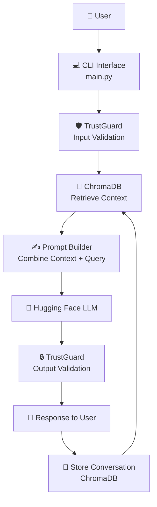

# 🤖 GenCSM – AI-Powered Customer Service Assistant

---

[](https://www.python.org/)
[](https://huggingface.co/)
[](https://www.trychroma.com/)
[](https://pypi.org/project/trustguard/)
[](LICENSE)
[](https://github.com/your-username/gencsm)
[](https://github.com/your-username/gencsm)

---

# ✨ About GenCSM

**GenCSM** is an **AI-powered Customer Service Management Assistant** designed to deliver **secure, intelligent, and context-aware responses**.

The system combines **Large Language Models (LLMs)**, **vector memory**, and **AI safety trustguard** to create a reliable conversational assistant.

GenCSM focuses on:

* 🤖 Intelligent AI responses
* 🧠 Persistent conversation memory
* 🔒 Protection of sensitive information
* 💬 Natural multi-turn conversations

---

# 🌟 Features

| Feature                     | Description                                 |
| --------------------------- | ------------------------------------------- |
| 💬 Conversational AI        | Human-like responses powered by LLMs        |
| 🧠 Persistent Memory        | Stores conversation history using ChromaDB  |
| 🔒 PII Protection           | TrustGuard prevents sensitive data exposure |
| 🔄 Multi-turn Conversations | Maintains context across sessions           |
| ⚡ Fast Retrieval            | Semantic search using vector embeddings     |
| 🧩 Modular Architecture     | Easy to extend and maintain                 |

---

# 🧠 Architecture Diagram



---

# 📊 System Workflow

### 1️⃣ User Interaction

The user sends a query through the **CLI interface**.

### 2️⃣ Input Safety Validation

The message is checked by **TrustGuard** to detect **PII or unsafe content**.

### 3️⃣ Memory Retrieval

Relevant past conversations are retrieved from **ChromaDB** using vector similarity search.

### 4️⃣ Prompt Construction

The system constructs a prompt using:

* system instructions
* retrieved context
* current user message

### 5️⃣ LLM Processing

The prompt is sent to a **Hugging Face hosted model** to generate a response.

### 6️⃣ Output Safety Validation

The response is validated again using **TrustGuard** to ensure no sensitive information is leaked.

### 7️⃣ Response Delivery

The safe response is returned to the user.

### 8️⃣ Memory Storage

The interaction is stored in **ChromaDB** to maintain conversation history.

---

# ⚡ Installation

Clone the repository:

```bash
git clone https://github.com/dr-mo-khalaf/GenCSM.git
cd GenCSM
```

Create a virtual environment:

```bash
python -m venv venv
```

Activate the environment.

Linux / macOS:

```bash
source venv/bin/activate
```

Windows:

```bash
venv\Scripts\activate
```

Install dependencies from **pyproject.toml**:

```bash
pip install .
```

---

# 📦 `pyproject.toml`

GenCSM uses **modern Python dependency management** via `pyproject.toml`.

```toml
[project]
name = "gencsm"
version = "0.1.0"
description = "AI-powered Customer Service Management Assistant"
readme = "README.md"
requires-python = ">=3.11"

dependencies = [
    "chroma-migrate>=0.0.7",
    "chromadb>=1.5.2",
    "dotenv>=0.9.9",
    "huggingface-hub>=1.5.0",
    "trustguard>=0.2.4",
]
```

---

# 🔑 Environment Variables

Create a `.env` file in the root directory:

```env
HF_API_KEY=your_huggingface_api_token
```

You can obtain an API key from the **Hugging Face account settings**.

---

# 🚀 Usage

Run the chatbot:

```bash
python main.py
```

Example interaction:

```
Please enter your User ID: 1

Welcome Jo! You can start chatting with GenCSM.

Jo: my AI course registration number

GenCSM: Your registration number for the AI course is AI1234.
Would you like more details about the course?
```

---

# 📁 Project Structure

```
GenCSM/
│
├── main.py
├── memory.py
├── pyproject.toml
├── .env
├── README.md
│
└── chroma_db/
```

| File             | Description                            |
| ---------------- | -------------------------------------- |
| `main.py`        | Main chatbot application               |
| `memory.py`      | Handles vector memory storage          |
| `pyproject.toml` | Project configuration and dependencies |
| `.env`           | Environment variables                  |
| `chroma_db/`     | Persistent vector database             |

---

# 🛠 Technology Stack

| Layer         | Technology       | Purpose                         |
| ------------- | ---------------- | ------------------------------- |
| Language      | Python           | Core application                |
| LLM           | Hugging Face Hub | Response generation             |
| Vector DB     | ChromaDB         | Memory storage                  |
| Safety        | TrustGuard       | PII detection and protection    |
| Configuration | dotenv           | Environment variable management |

---

# 🔐 Security

GenCSM integrates **TrustGuard** to ensure responsible AI usage:

* Detects **personally identifiable information (PII)**
* Prevents **sensitive data leakage**
* Validates both **input and output messages**

This ensures the assistant operates safely in **customer-service environments**.

---

# 🤝 Contributing

Contributions are welcome!

1️⃣ Fork the repository

2️⃣ Create a feature branch

```bash
git checkout -b feature-name
```

3️⃣ Commit changes

```bash
git commit -m "Add new feature"
```

4️⃣ Push changes

```bash
git push origin feature-name
```

5️⃣ Open a Pull Request

---

# 📜 License

This project is licensed under the **MIT License**.

---

# 🎯 Highlights

✅ AI-powered conversational assistant
✅ Persistent vector memory with ChromaDB
✅ Built-in security with TrustGuard
✅ Modern Python packaging with `pyproject.toml`
✅ Modular and extensible architecture

---

⭐ If you find this project useful, consider **starring the repository**!
